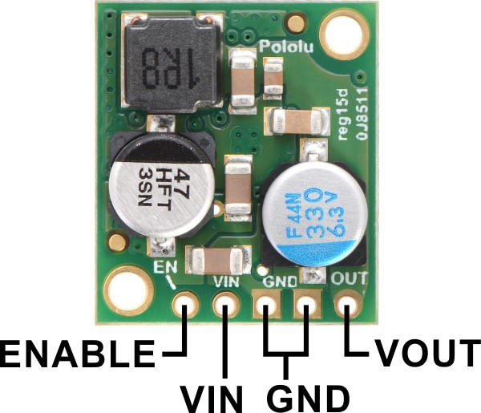
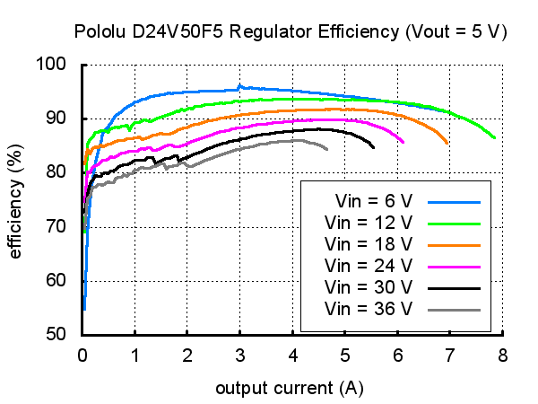

# Electrical

## Raspberry Pi

Adaptor board to connect the RPi to sensors/actuators

## Sensors

[360 Laser Distance Sensor LDS-01 (LIDAR)](http://www.robotis.us/360-laser-distance-sensor-lds-01-lidar/)

## Power

Power distribution board just passes the input power to the 16 AX12 servos and the RPi/Sensors.

### [Pololu 5V Buck Regulator](https://www.pololu.com/product/2851)

### [Pololu 12V Buck Regulator](https://www.pololu.com/product/2885)

# Bill of Materials (BoM)

| Part | Qnty | Each | Cost |
|---|---|---|---|
| Raspberry Pi | 1 | $35 | $35 |
| Lidar | 1 | $180 | $180 |
| RPi AX12 adaptor board | 1 | $20 est. | $20 |
| Power Distrobution board | 1 | $30 est. | $30 |
| Pololu 12V Buck Regulator | 2 | $40 | $80 |
| Pololu 5V Buck Regulator | 1 | $15 | $15 |
| **Total** | | | **$360** |
