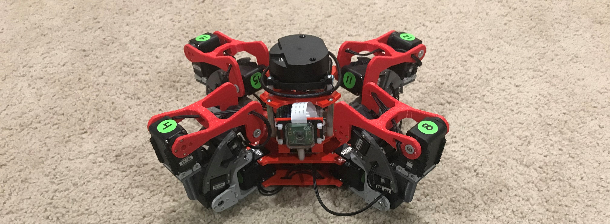

# AX-12A Quadruped

Features:

- Robotis AX-12A servos
- 4 legs
    - 4 servos per leg for added degrees of freedom
- Raspberry Pi 3 controlled w/camera
- Robotis lidar for obstacle avoidance and SLAM
- 12V power system
- Externally powered so no limit on run time
    - A battery could be designed and integrated

# Hardware

**Still under development**

- [Mechanical Hardware](mechanical/)
- [Electrical Hardware](electrical/)

# Software

Uses [multiped library](https://github.com/MultipedRobotics/multiped/) to control it.

Other SW is TBD until the design is finished

# Software is MIT License

**Copyright (c) 2018 Kevin J. Walchko**

Permission is hereby granted, free of charge, to any person obtaining a
copy of this software and associated documentation files (the
"Software"), to deal in the Software without restriction, including
without limitation the rights to use, copy, modify, merge, publish,
distribute, sublicense, and/or sell copies of the Software, and to
permit persons to whom the Software is furnished to do so, subject to
the following conditions:

The above copyright notice and this permission notice shall be included
in all copies or substantial portions of the Software.

THE SOFTWARE IS PROVIDED "AS IS", WITHOUT WARRANTY OF ANY KIND,
EXPRESS OR IMPLIED, INCLUDING BUT NOT LIMITED TO THE WARRANTIES OF
MERCHANTABILITY, FITNESS FOR A PARTICULAR PURPOSE AND NONINFRINGEMENT.
IN NO EVENT SHALL THE AUTHORS OR COPYRIGHT HOLDERS BE LIABLE FOR ANY
CLAIM, DAMAGES OR OTHER LIABILITY, WHETHER IN AN ACTION OF CONTRACT,
TORT OR OTHERWISE, ARISING FROM, OUT OF OR IN CONNECTION WITH THE
SOFTWARE OR THE USE OR OTHER DEALINGS IN THE SOFTWARE.

---

    
     The hardware (mechanical/electrical/documentation) is licensed under a <a rel="license" href="http://creativecommons.org/licenses/by-sa/4.0/">Creative Commons Attribution-ShareAlike 4.0 International License</a>.

